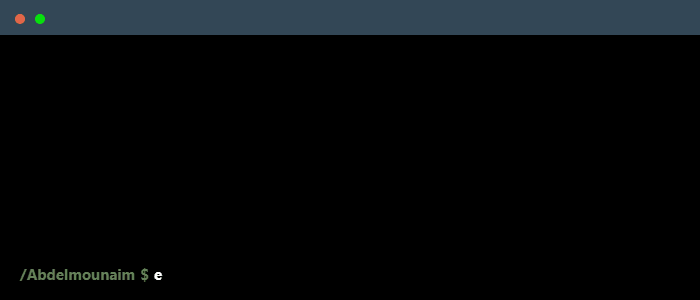

 

    

- 📫 Reach me at: [abdelmounaimtarniche@gmail.com](mailto:abdelmounaimtarniche@gmail.com)

## Machine Learning

  
  
  
  
  
  
  

## Cloud Providers

  
  
  
  

## DevOps & Tools

  
  
  

## Databases

  
  
  
  
  

## Other Tools

  
  

